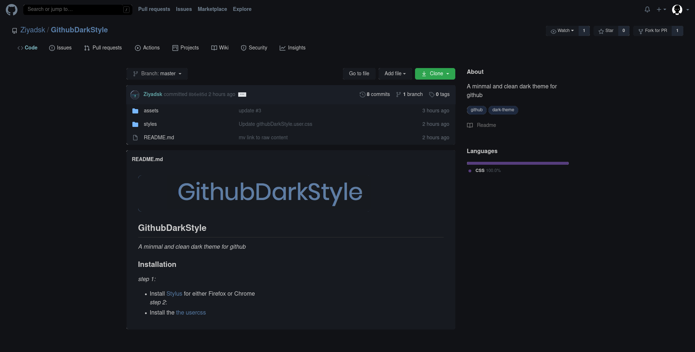

## Installation
1. Install [Stylus](https://github.com/openstyles/stylus) browser add-on
2. Click [INSTALL STYLE](https://raw.githubusercontent.com/Ziyadsk/GithubDarkStyle/master/githubDarkStyle.user.css)
